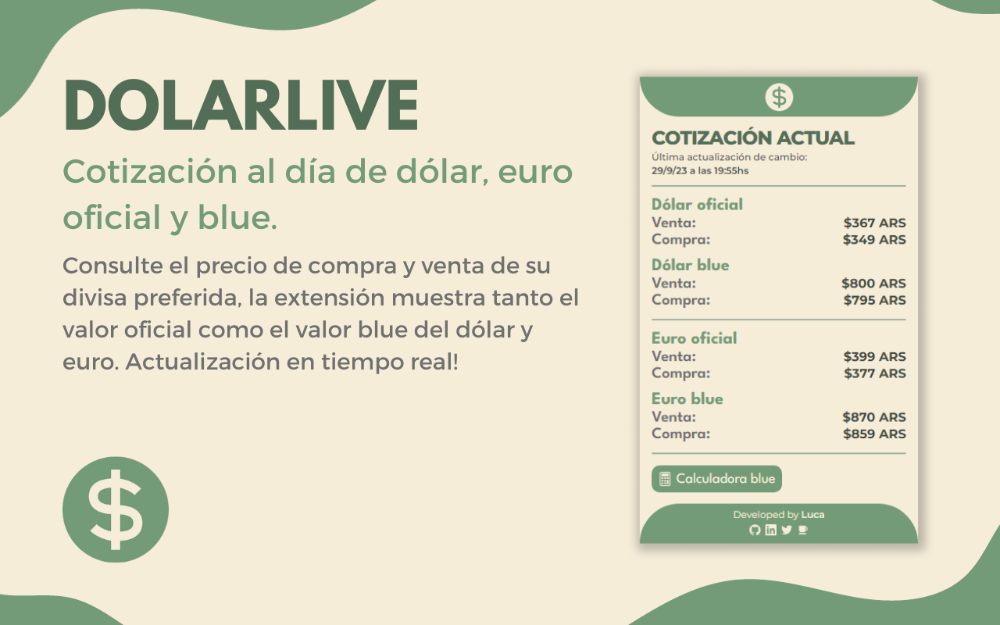
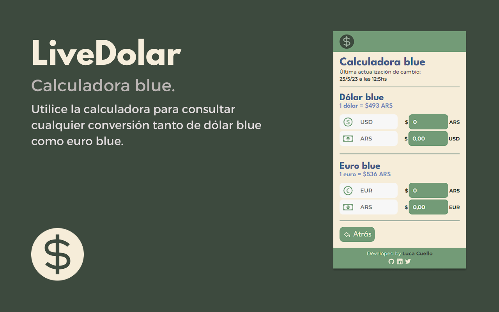

# DolarLive

## Sobre el proyecto

Extensión de Chrome y Opera pensada para uso regional en Argentina que mediante consumo de API, utilicé esta [API](https://dolarapi.com/docs/) para la consulta de todas las divisas.

La extensión devuelve el valor diario del dólar oficial, dólar blue, dolar tarjeta, entre entros. Además, incluye una calculadora para poder visualizar la conversión entre pesos y dólares en cada uno de estos tipos.

La misma fue creada con React y TypeScript mediante el uso de [CRXJS](https://github.com/crxjs/chrome-extension-tools), usando librerías externas como react-icons para los iconos y framer-motion para las animaciones.

## Características

## Instalación

### Instalación mediante la store oficial

Para instalar la extensión directo desde la store oficial de Chrome, [clickear aquí](https://t.co/k3usF9snUz).

### Instalación manual

Para instalar la extensión, descargar de este mismo repositorio la carpeta llamada "dolarLiveExtension".
Luego, en Chrome:

`Más herramientas > Extensiones > Activar modo desarrollador > Cargar descomprimida.`

Una vez abierto el recruadro de búsqueda de archivos, seleccionar la carpeta "dolarLiveExtension" previamente descargada.

## Agradecimientos

Mención y agradecimiento a [Enzo Notario](https://github.com/enzonotario) por ser el creador de la API que utilicé para hacer posible este proyecto 😁
