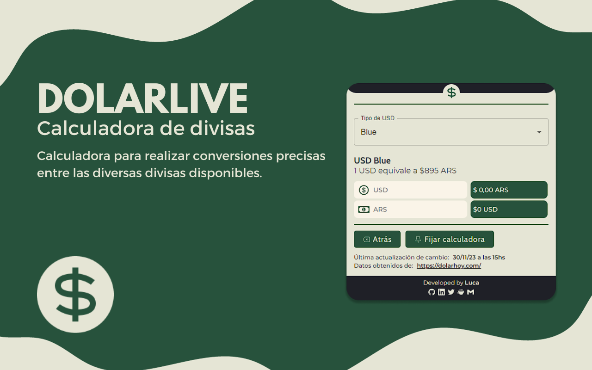

# DolarLive

## About

Extensión de Chrome y Opera pensada para uso regional en Argentina que mediante llamado a dos APIS, utilicé esta [API](https://bluelytics.com.ar/#!/api) para la consulta del valor del Euro, y esta [API](https://dolar-api-argentina.vercel.app/) para la consulta del valor del dólar.
La extensión devuelve el valor diario del dólar oficial, dólar blue, euro oficial y euro blue. Además, incluye una calculadora para poder visualizar la conversión entre un valor custom en pesos y el valor del dólar/euro blue y viceversa.
La misma fue creada con React y TypeScript mediante el uso de [CRXJS](https://github.com/crxjs/chrome-extension-tools), usando librerías externas como react-icons para los iconos y framer-motion para las animaciones.

## Features

## Installation

### Instalación mediante la store oficial

Para instalar la extensión directo desde la store oficial de Chrome, [clickear aquí](https://t.co/k3usF9snUz).

### Instalación manual

Para instalar la extensión, descargar de este mismo repositorio la carpeta llamada "dolarLiveExtension".
Luego, en Chrome:

`Más herramientas > Extensiones > Activar modo desarrollador > Cargar descomprimida.`

Una vez abierto el recruadro de búsqueda de archivos, seleccionar la carpeta "dolarLiveExtension" previamente descargada.
